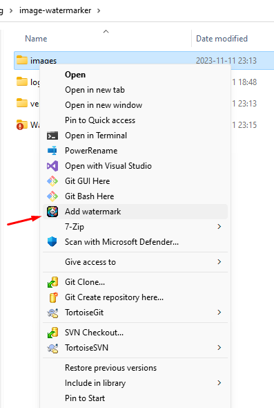

  
  <h1 align="center">Watermarker</h1>

This is a simple application designed for specific use-case: apply filename watermark to a bunch of pictures

# Example

# Installation

1. Download latest release from [Release page](https://github.com/kuleshov-aleksei/Watermarker/releases/latest)
2. Unzip `watermarker-installer-v1.1.11.zip`, and execute `Watermarker.Installer.exe` (requires admin privileges)
3. After installation a new entry for folders will be added to context menu (see more in [Usage](#usage))
4. Installed application is located at `C:\Program Files\Encamy\Watermarker`. Logs are located at `%TMP%\Watermarker\logs`
5. You can uninstall application using the same installator, just press `Uninstall`

# Usage

After installation you can select any folder with images and execute `Add watermark`

Application will create a new folder nearby with processed files

# Customization

Customization is not rich at all, but you can tweak some parameters like colors and position

Config file located at `C:\Program Files\Encamy\Watermarker\config.json`

| Parameter name | Description | Default value |
| -------------- | ----------- | ------------- |
| ParallelThreads | How much threads application should create. This parameter have a great impact on overall speed and RAM consumption | 4 |
| FontName | Which font should be used. Currently there are only 3 fonts: `Agbalumo`, `Roboto` and `Rubik Mono One` | Rubik Mono One |
| FontScalingFactor | Text have a bounding box. This is a scale of this bounding box. 1 means text will start at left side and end at right side | 0.8 |
| OffsetFromBottom | Offset from bottom, a fraction of overall image size | 0.1 |
| InfillColor | Color of text (rgba format is also supported) | rgb(67, 198, 161) |
| BorderColor | Border color | rgb(0, 0, 0) |

# Commit convention

| Emoji | Name                 | Action                        |
| ----- | -------------------- | ----------------------------- |
| ♻    | `:recycle:`          | Refactor                      |
| ✏    | `:pencil2:`          | Write code                    |
| 🐛    | `:bug:`              | Fix bugs                      |
| 🔥    | `:fire:`             | Create release                |
| 📝    | `:memo:`             | Write docs                    |
| 📦    | `:package:`          | Update (or modify) packages   |